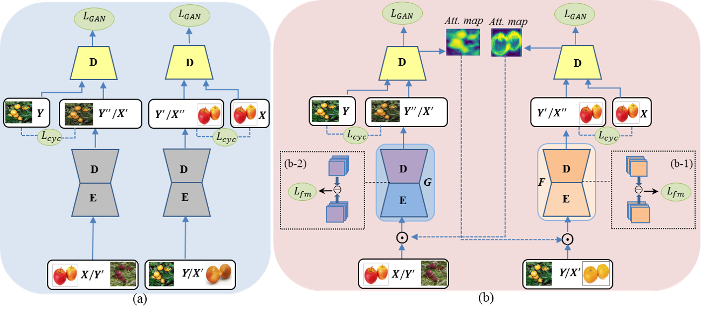

# Spatial Attention GAN for Image-to-Image Translation

PyTorch Implementation of [SPA-GAN](https://arxiv.org/pdf/1908.06616.pdf).
## Deliverables
### Paper + Presentation
[SPA-GAN](paper.pdf), [ppt](SPA-GAN.pptx)
### Dataset used 
[Facades Kaggle Version](https://www.kaggle.com/datasets/balraj98/facades-dataset)

[Facades](facades.zip)
### Model
[Resnet-based generator model](CycleGAN.ipynb)

[U-net based generator model](main.py)
### Project Documentation
[SPA-GAN Documentation](SPA-GAN Documentation.docx)

## Overview


## Architecture

#### CycleGAN (a) and SPA-GAN (b) architecture 

## Prerequites
* [Python](https://www.continuum.io/downloads)
* [PyTorch](http://pytorch.org/)
* [torchvision]('https://pytorch.org/docs/stable/torchvision/index.html')
* [matplotlib](http://matplotlib.org/)
* [dload]('https://pypi.org/project/dload/')
* [numpy](http://www.numpy.org/)
* [Pillow](https://pillow.readthedocs.io/en/5.1.x/)
* [wandb](https://www.wandb.ai/)
<br>

To install these packages, run the following command:

```bash
pip install -r requirements.txt
```

## Usage

To run the script, open a terminal and navigate to the directory containing the script. Then, run the following command:

```bash
python main.py [OPTIONS]
```
The following options are available:

- `--dataset`: specify the dataset name (string, default='facades')
- `--epochs`: specify the number of epochs (integer, default=10)
- `--lr`: specify the learning rate (float, default=0.0002)
- `--beta1`: specify the beta1 parameter for the Adam optimizer (float, default=0.5)
- `--beta2`: specify the beta2 parameter for the Adam optimizer (float, default=0.999)
- `--generate_source`: specify the source for generating images (string, default=None)
- `--generate_target`: specify the target for generating images (string, default=None)
- `--save_checkpoint`: specify whether to save the model checkpoints during training (Boolean, default=True)
- `--checkpoint_dir`: specify the directory where the model checkpoints will be saved (string, default='checkpoints')
- `--load_checkpoint`: specify whether to load the model checkpoint before training (Boolean, default=True)
- `--wandb`: specify whether to use the Weights and Biases platform for visualization and logging (Boolean, default=False)
- `--evaluate`: specify whether to evaluate the model (Boolean, default=False)

For example, to train the model on the Facades dataset for 100 epochs, run the following command:

```bash
python main.py --dataset facades --epochs 100
```

To generate images from the trained model, run the following command:

```bash
python main.py --generate_source [PATH_TO_SOURCE] --generate_target [PATH_TO_TARGET]
```

For example, to generate images from the trained model on the Facades dataset, run the following command:

```bash
python main.py --generate_source datasets/facades/testA/1.jpg --generate_target datasets/facades/testB/1.jpg
```

To visualize the training process using the Weights and Biases platform, run the following command:

```bash
python main.py --wandb True
```

